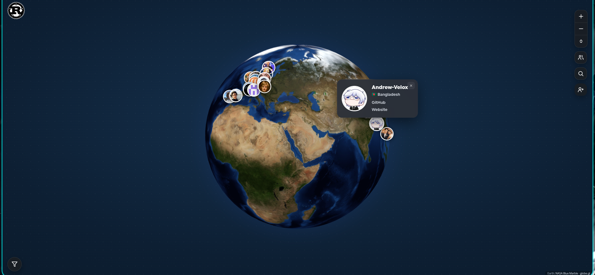
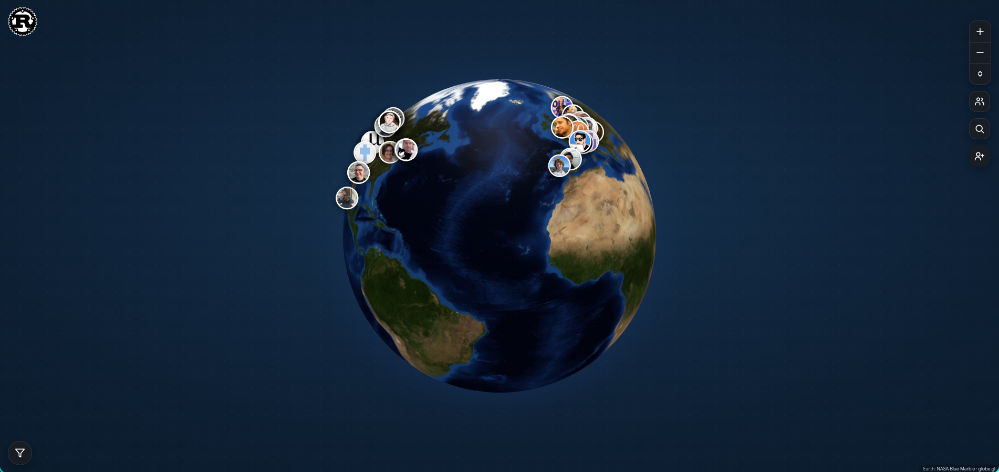

# Rust User Map

An interactive world map of Rustaceans. Every member is a Ferris crab dropped at their (rough) location that flips over to reveal their GitHub avatar.

**[Open the map](https://andrew-velox.github.io/rust-user-map)**

<p align="center">
  
  
</p>

<!-- The member list is a folder of small JSON files. A Rust CLI validates them and bundles them into the data the site loads, and GitHub Actions redeploys the page on every push. -->

## Add yourself

Drop one file into the [`user/`](user/) folder named `<your-username>.json` and open a PR — either with the add button on the map (it pre-fills the PR for you) or [directly on GitHub](https://github.com/Andrew-Velox/rust-user-map/new/main/user).

```json
{
  "username": "Andrew-Velox",
  "coordinates": [23.83099, 90.55631],
  "links": {
    "GitHub": "https://github.com/Andrew-Velox",
    "Website": "https://example.com"
  }
}
```

- `username` must match the filename (case-insensitive).
- `coordinates` are `[latitude, longitude]` — as precise or as vague as you like.
- `links` is optional; each key becomes a labelled link, and a `GitHub` link powers your avatar pin.

The build rejects files that don't parse, whose username doesn't match the filename, or whose coordinates are out of range.

## Built with

Rust (`clap`, `serde`) for the validate/build CLI, and [globe.gl](https://github.com/vasturiano/globe.gl) (three.js) with a NASA Blue Marble texture for the 3D globe.

---

Inspired by the [Zig community user map](https://github.com/zig-community/user-map), [AWS Heroes map](https://aws.amazon.com/developer/community/heroes/).

Community meetup data from [rust-communities-map](https://github.com/mamaicode/rust-communities-map) by mamaicode.

Ferris artwork by the [Rust Foundation](https://github.com/rust-lang/rust-artwork). Not affiliated with the Rust project.
